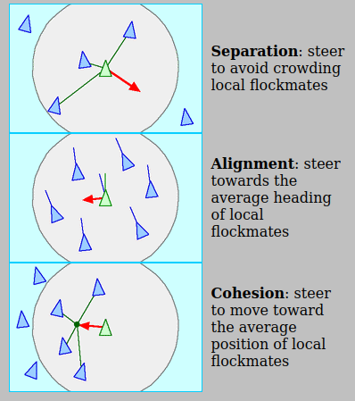
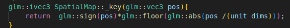
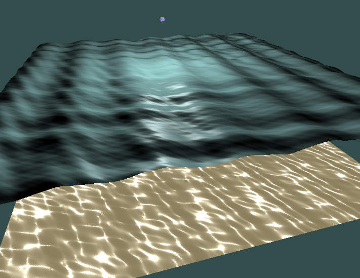



[Link to the project here](https://github.com/dinoplane/flocking)


# Introduction

This has been long overdue, but nonetheless, I think a small update should suffice for now.

From the last time I posted to now, I have done some work on this project, but not quite as I hoped for. My first quarter of graduate school had took some unexpected turns, piling lots of busy work on my end. If I'd learn anything, it'd be that I cannot take exam-based courses (and UCLA) lightly.

But anyways, let me present the main feature of this update: MULTITHREADING! <br/><br/>

# Multithreading Boids

The boids algorithm looks something like this:

```python3
        while True:
            # fork
            for b in boids:
                b.calculatePosition()
            # join
            render(boids)

        class Boid:
            ...
            def calculatePosition(self):
                for beh in self.behaviors:
                    self.force += beh(self)
                self.velocity += self.force
                self.velocity = clamp(self.velocity, self.maxSpeed)
                self.position += self.velocity
                self.applyTransformsToModel()
            ...
```

In this code, `calculatePosition()` calculates a force, which is added to a velocity used to calculate the new position of the boid.

From here, we may multithread the calculatePosition operation, with each thread handling the calculations for `NUM_BOIDS / NUM_THREADS` boids (this is a rough estimate).

We make sure that each thread handles a chunk of the global boid array to avoid false sharing (loading in new cache blocks due to cache incoherency). So thread #0 may handle boids #0 through #15, thread #1 handles boids #16 to #31, thread #2 handles #32 to #47 etc...

HOWEVER!

There is a problem when we try this method. Some threads may execute faster than others, which result in some boid positions being updated before others. This causes the boid forces calculated by the slower threads to use the new positions.

We fix this by splitting `calculatePosition()` into two parts: the force calculation and the position update.

```python3
    while True:
        # fork
        for b in boids:
            b.calculateForce()
        # join

        # fork
        for b in boids:
            b.calculatePosition()
        # join

        render(boids)

    class Boid:
        ...
        def calculateForce(self):
            for beh in self.behaviors:
                self.force += beh(self)

        def calculatePosition(self):
            self.velocity += self.force
            self.position += self.velocity
            self.applyTransformsToModel()
        ...
```
By separating the function into the two parts, we synchronize the calculation operation (one may say that the positions are updated in *lock-step*).

Multiple forks and joins incur overhead, so we may further improve this code by incorporating a barrier. The idea is for threads to arrive at the barrier and stall until all other threads arrive as well. Only then will the threads resume execution again.

```python3
    while True:
        # fork
        for b in boids:
            b.calculateForce()
            # barrier
            b.calculatePosition()
        # join

        render(boids)
```

This is pretty much it for the multithreading. However, we may further optimize the boid algorithm with some interesting observations. <br/><br/>

# Spatial Hash Grid

Many boid behaviors calculate the force exerted onto itself depending on the positions of the boids inside a certain range (i.e. cohesion, separation, and alignment). Currently, each boid (A) iterates through all of the boids (B) in the world to check whether B is in A's range.


*image taken from [here](http://www.red3d.com/cwr/boids/)*

This is extremely inefficient. In the extreme case, a boid can be far away from a group of boids, but still need to iterate through these boids. Thus, we need a method to limit the search space.

There are 2 main ways to solve the problem, octrees or hash grids. Both divide the world space into smaller units, so that the object in a tile will only need to check the nearby tiles (in the best case, we only check adjacent tiles!).

*Octrees* are tree structures that divide tiles recursively into 8 units based on the quantity of objects in a area. This makes the tree quite memory efficient. Because of complexity of trees in general, it's harder to implement.

*Spatial hash grids* are hash maps that map tiles(that are a set size) to a set of objects. This is considerably easier(and faster) to implement, but suffers from memory wastage.

I chose the latter route because I was kinda pressed on time (it was in the midst of the new quarter when I was extremely busy).

To implement the spatial hash grid, we start by initializing it with the tile dimensions and the grid dimensions. I opted for lazy creation if any new tiles needed to be created. With initialization out of the way, there are four main parts we must consider:

- Adding a boid to a tile: We can calculate the tiles (a boid can sit on a border) the boid is in from its position using a simple formula.  Using a struct (a `SpatialEntry`) to encapsulate all necessary information for easy access later, we find the top right front tile and the bottom right back tile and add the entry into the corresponding sets.

- Removing a boid from a tile: Given that we already stored the boid's containing tiles in the entry struct before, we can iterate through the bounding tiles and remove the boid from them.

- Updating a boid's tiles: Updating could be done very lazily. We remove the boid from the grid, and add the boid to it again!

- Accessing a boid's nearby tiles, given a range: Just like when we added the boid, we calculate the indices of the bounding tiles with the range. Then, we use those indices to query into the hash grid. Within each grid, we do the check.

Of course, this is just a high level description of the implementation. The intricacies can be found in the code...
<br/><br/>

# Results

So how well does each optimization help?

With 600 boids, we see a 1094% speedup comparing the multithreaded (16 threads) spatial map calculation time with the single threaded time. With 1000 boids, we see a 238% speedup between the multithreaded spatial map time with the multithreaded time. I have plotted the times in a line graph below for easier visualization.

        
# Extra!!!

I looked at Acerola's [video](https://www.youtube.com/watch?v=PH9q0HNBjT4) on ocean waves with sine and [GPUGems](https://developer.nvidia.com/gpugems/gpugems/part-i-natural-effects/chapter-2-rendering-water-caustics) for water caustics to create the following effect!



Yes, I know there is tiling with this method. And I feel the lighting on the water is a bit weird... not exactly sure how that came to be...

<br/>

# Next Steps
(which I may or may not do XD)

1. Move position calculation to the GPU. Since positions are calculated in lockstep, there is no reason not to try to move the calculation to the GPU. This may become complicated...

2. Implement an Octree. Even though an octree is harder to implement, it doesn't hurt to try right?

3. Spatial Hash Grid Thread Optimization: Currently the hash grid is thread safe. ... Ok I kinda cheated by just locking the entire map whenever we need to update it. The reason I did that was because I ran into deadlock issues when trying to implement locks per key. This leaves threads that stalling when their updates will not influence each other.

4. Spatial Hash Grid Unit Dimensions: I haven't tweaked the unit dimensions of the spatial hash grid much, but I believe that there is merit to doing so. I wonder if there is any way to simulate over and over again to get the values I want....

5. Boid Behavior Optimization: It's absurd to need to iterate through every boid in a range to get the final force, especially when we are comparing against a clump of boids. Couldn't we also just average the positions and vectors of boids in a flock to reduce the amount of iteration? This strategy probably works well with octrees... All the more to implement one...

6. Better graphics/UI/SWE principles/any quality of life improvements

Yeah, this is what I could think of right now, but I'm not sure if I have time to get to it, given that I'm also trying to learn Vulkan right now. But until next time!

- Alien
